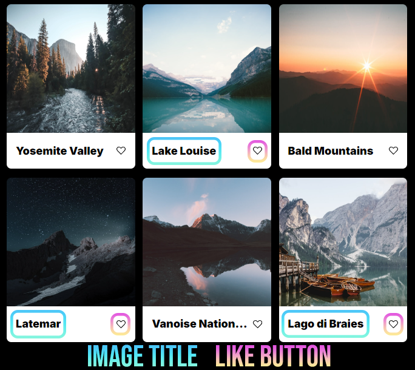

# Project 3: Around The U.S.

### Description and Features

This project revolves around a platform tailored for aspiring adventurers, providing them with an engaging and interactive webpage to document their global experiences.

- The first segment empowers users to personalize their profiles by selecting an avatar and specifying their role.
- The subsequent section showcases captivating landscapes encountered during users' journeys through visually appealing cards. Each card offers a glimpse into the scenic beauty, accompanied by a title and a heart-shaped like button for users and friends to click and show their affection.
- Built with responsiveness in mind, the project seamlessly adapts to various screen sizes, ensuring optimal viewing experiences across laptops (1280px) and smartphones (320px). This achievement is attributed to the implementation of diverse units and values such as fr, %, max-width, alongside media queries.

**Technologies Involved**

- Figma
- HTML
- CSS

**Images**

**Links**

- [Link to the project on Github Pages](https://alexanderjmurphy92.github.io/se_project_aroundtheus/)
- [Link to Video on Google Drive](https://drive.google.com/file/d/1EQP8-xOiOgtikbkOwN5_oRJZQTrDmd8h/view?usp=drive_link)
